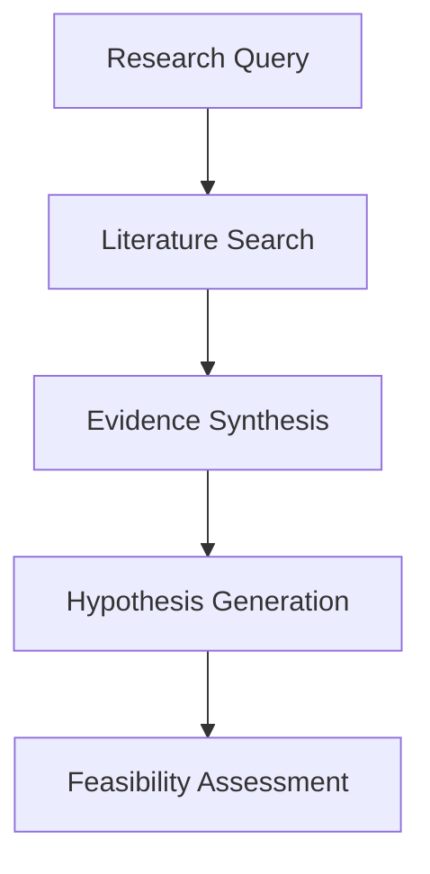
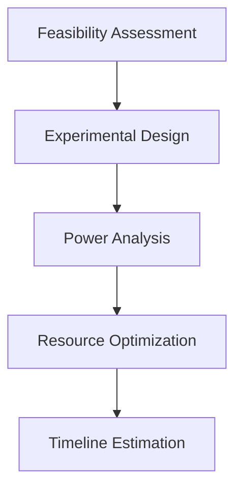
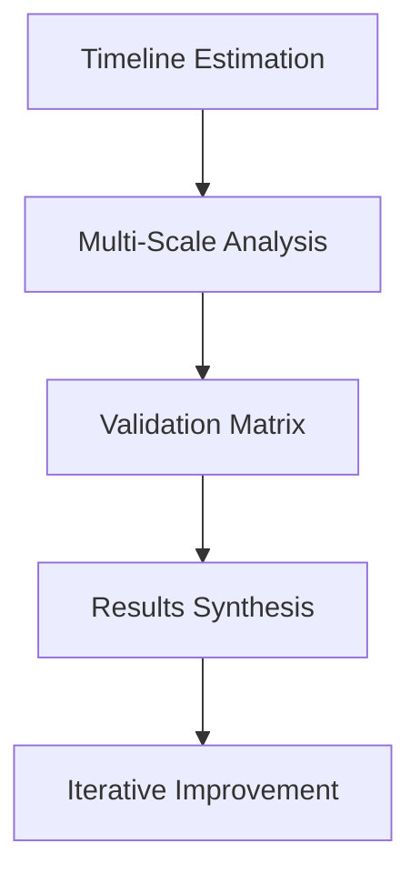
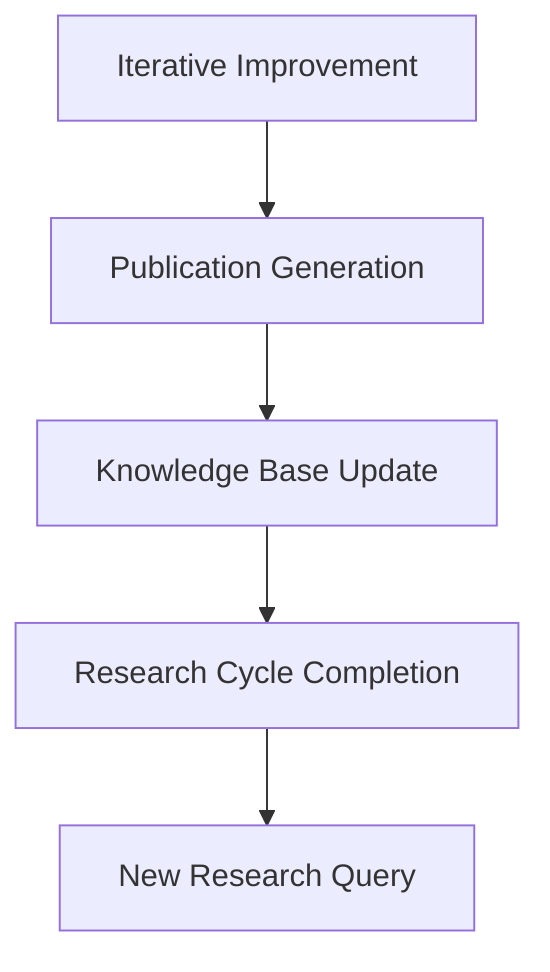

# 🔬 ATLAS Autonomous Laboratory - Complete Workflow Documentation

**Version:** 1.0.0  
**Date:** September 11, 2025  
**Status:** Production Ready

## 📋 Table of Contents
1. [System Overview](#system-overview)
2. [Workflow Architecture](#workflow-architecture)
3. [Component Integration](#component-integration)
4. [API Documentation](#api-documentation)
5. [Usage Examples](#usage-examples)
6. [Performance Guidelines](#performance-guidelines)
7. [Troubleshooting](#troubleshooting)

---

## 🌐 System Overview

ATLAS (Autonomous Laboratory for Advanced Scientific Research) is a comprehensive AI-powered research automation platform that enables end-to-end scientific research from hypothesis generation to experimental design optimization.

### 🎯 Core Mission
Transform scientific research through intelligent automation while maintaining rigorous scientific standards and reproducibility.

### 🏗️ Architecture Principles
- **Modularity**: Each component operates independently
- **Scalability**: Horizontal scaling across all services
- **Reliability**: Fault-tolerant with graceful degradation
- **Extensibility**: Easy integration of new models and capabilities

---

## 🔄 Workflow Architecture

### **Phase 1: Research Initiation**


### **Phase 2: Experimental Planning**


### **Phase 3: Execution & Analysis**


### **Phase 4: Knowledge Integration**


---

## 🧩 Component Integration

### 1. 🤖 **Specialized Scientific Models**
**Purpose**: Domain-specific AI analysis and text processing  
**Models**: BioGPT, ClinicalBERT, MatSciBERT, SciBERT  
**Integration Points**: All other components  

#### Workflow Integration:
```python
# Model selection based on research domain
async def select_optimal_model(research_domain: str, query_type: str):
    if research_domain == "biology":
        return await biogpt_service.analyze(query)
    elif research_domain == "medicine":
        return await clinicalbert_service.process(query)
    elif research_domain == "materials":
        return await matscibert_service.evaluate(query)
    else:
        return await scibert_service.analyze(query)
```

### 2. 🧠 **Scientific Reasoning Pipeline**
**Purpose**: End-to-end research workflow orchestration  
**Components**: Literature → Hypothesis → Experimentation  
**Integration**: Coordinates all other services  

#### Core Workflow:
```python
async def complete_research_cycle(research_goal: str, domain: str):
    # Phase 1: Literature Analysis
    literature = await literature_search_service.search(research_goal)
    
    # Phase 2: Hypothesis Generation
    hypotheses = await scientific_hypothesis_service.generate(
        literature, domain
    )
    
    # Phase 3: Experimental Planning
    experiments = await experimental_design_service.design(
        hypotheses, constraints
    )
    
    # Phase 4: Validation & Results
    results = await validation_matrix_service.validate(experiments)
    
    return research_pipeline_result
```

### 3. 🔬 **Multi-Scale Analysis Integration**
**Purpose**: Molecular to systems-level analysis  
**Models**: DNABERT2, GNOME Materials  
**Scales**: Molecular → Cellular → Tissue → Organ → Systems  

#### Scale Transition Logic:
```python
async def multi_scale_analysis(data: Any, start_scale: str, end_scale: str):
    current_scale = start_scale
    results = {}
    
    while current_scale != end_scale:
        if current_scale == "molecular":
            results[current_scale] = await dnabert2_service.analyze(data)
            current_scale = "cellular"
        elif current_scale == "materials":
            results[current_scale] = await gnome_service.predict(data)
            current_scale = "systems"
        # ... continue scale progression
    
    return integrate_multi_scale_results(results)
```

### 4. ✅ **Automated Experimental Validation**
**Purpose**: Hypothesis testing and result validation  
**Features**: Statistical analysis, quality control, reproducibility  
**Integration**: Validates outputs from all analysis components  

#### Validation Matrix:
```python
async def comprehensive_validation(
    hypothesis: Hypothesis, 
    experimental_data: ExperimentData
):
    validation_result = ValidationResult()
    
    # Statistical validation
    stats = await statistical_validation(experimental_data)
    validation_result.statistical_significance = stats
    
    # Reproducibility check
    reproducibility = await reproducibility_service.validate(
        experimental_data
    )
    validation_result.reproducibility_score = reproducibility
    
    # Multi-domain cross-validation
    cross_validation = await cross_domain_validation(hypothesis)
    validation_result.cross_validation = cross_validation
    
    return validation_result
```

### 5. 🔄 **Iterative Improvement Pipeline**
**Purpose**: Self-learning and optimization  
**Features**: Feedback integration, parameter tuning, performance optimization  
**Integration**: Learns from all component interactions  

#### Learning Mechanism:
```python
async def iterative_improvement_cycle(
    experiment_results: ExperimentResults,
    performance_metrics: PerformanceMetrics
):
    # Record feedback
    feedback = await feedback_service.record(
        experiment_results, performance_metrics
    )
    
    # Analyze performance patterns
    patterns = await pattern_analysis_service.analyze(feedback)
    
    # Generate optimization recommendations
    recommendations = await optimization_service.recommend(patterns)
    
    # Apply improvements
    improved_parameters = await parameter_tuning_service.optimize(
        recommendations
    )
    
    return improved_parameters
```

### 6. 🔗 **Advanced Evidence Synthesis**
**Purpose**: Multi-source evidence integration and conflict resolution  
**Features**: Evidence clustering, cross-domain connections, confidence scoring  
**Integration**: Synthesizes outputs from literature and analysis components  

#### Synthesis Algorithm:
```python
async def advanced_evidence_synthesis(
    evidence_sources: List[EvidenceSource]
):
    # Cluster related evidence
    clusters = await evidence_clustering_service.cluster(evidence_sources)
    
    # Detect cross-domain connections
    connections = await cross_domain_detection_service.detect(clusters)
    
    # Resolve conflicts
    resolved_evidence = await conflict_resolution_service.resolve(
        clusters, connections
    )
    
    # Generate synthesis
    synthesis = await synthesis_generation_service.generate(
        resolved_evidence
    )
    
    return synthesis
```

### 7. 📊 **Experimental Design Assistant**
**Purpose**: Optimal experimental design generation  
**Features**: Multiple design types, power analysis, resource optimization  
**Integration**: Uses inputs from all analysis components for design optimization  

#### Design Generation:
```python
async def optimal_experimental_design(
    research_objectives: List[ResearchObjective],
    resource_constraints: ResourceConstraints
):
    # Analyze objectives
    design_requirements = await analyze_objectives(research_objectives)
    
    # Calculate optimal sample size
    sample_analysis = await power_analysis_service.calculate(
        design_requirements
    )
    
    # Assess feasibility
    feasibility = await feasibility_service.assess(
        sample_analysis, resource_constraints
    )
    
    # Generate design
    experimental_design = await design_generation_service.generate(
        design_requirements, sample_analysis, feasibility
    )
    
    return experimental_design
```

---

## 🌊 **Complete Workflow Execution**

### **Full Research Pipeline Example:**

```python
async def complete_autonomous_research(
    research_goal: str,
    domain: str,
    constraints: Dict[str, Any]
):
    """
    Complete autonomous research workflow
    """
    
    # Step 1: Initialize research context
    research_context = ResearchContext(
        goal=research_goal,
        domain=domain,
        constraints=constraints,
        timestamp=datetime.now()
    )
    
    # Step 2: Literature analysis and evidence synthesis
    print("🔍 Phase 1: Literature Analysis & Evidence Synthesis")
    literature_results = await literature_search_service.comprehensive_search(
        query=research_goal,
        domain=domain,
        max_papers=100
    )
    
    evidence_synthesis = await evidence_synthesis_service.synthesize_evidence(
        evidence_sources=literature_results.papers,
        research_context=research_context
    )
    
    # Step 3: Hypothesis generation using specialized models
    print("💡 Phase 2: Hypothesis Generation")
    model = await select_domain_model(domain)
    
    hypotheses = await scientific_hypothesis_service.generate_hypotheses(
        evidence_synthesis=evidence_synthesis,
        research_goal=research_goal,
        domain_model=model
    )
    
    # Step 4: Multi-scale analysis for each hypothesis
    print("🔬 Phase 3: Multi-Scale Analysis")
    multi_scale_results = []
    
    for hypothesis in hypotheses:
        if domain in ["biology", "medicine"]:
            molecular_analysis = await dnabert2_service.analyze_sequences(
                sequences=hypothesis.molecular_targets
            )
        elif domain in ["materials", "chemistry"]:
            materials_analysis = await gnome_service.predict_properties(
                materials=hypothesis.material_candidates
            )
        
        scale_result = await multi_scale_integration_service.integrate(
            hypothesis, molecular_analysis if 'molecular_analysis' in locals() 
            else materials_analysis if 'materials_analysis' in locals() else None
        )
        
        multi_scale_results.append(scale_result)
    
    # Step 5: Experimental design optimization
    print("📊 Phase 4: Experimental Design Optimization")
    research_objectives = [
        ResearchObjective(
            id=f"obj_{i}",
            title=hyp.title,
            description=hyp.description,
            domain=domain,
            hypothesis=hyp.statement,
            effect_size_expected=hyp.expected_effect_size
        )
        for i, hyp in enumerate(hypotheses)
    ]
    
    resource_constraints = ResourceConstraints(
        budget=constraints.get("budget"),
        time_months=constraints.get("time_months"),
        max_participants=constraints.get("max_participants"),
        available_equipment=constraints.get("equipment", []),
        staff_expertise=constraints.get("expertise", [])
    )
    
    experimental_designs = []
    for objective in research_objectives:
        design = await experimental_design_service.design_experiment(
            research_objectives=[objective],
            resource_constraints=resource_constraints
        )
        experimental_designs.append(design)
    
    # Step 6: Validation and quality assessment
    print("✅ Phase 5: Validation & Quality Assessment")
    validation_results = []
    
    for design in experimental_designs:
        validation = await validation_matrix_service.validate_design(
            experimental_design=design,
            multi_scale_results=multi_scale_results
        )
        validation_results.append(validation)
    
    # Step 7: Results synthesis and iterative improvement
    print("🔄 Phase 6: Results Synthesis & Iterative Improvement")
    performance_metrics = PerformanceMetrics(
        validation_scores=[v.overall_score for v in validation_results],
        feasibility_scores=[d.feasibility_score for d in experimental_designs],
        hypothesis_quality=[h.confidence_score for h in hypotheses]
    )
    
    # Record feedback for learning
    feedback_data = await iterative_improvement_service.record_feedback(
        research_context=research_context,
        hypotheses=hypotheses,
        experimental_designs=experimental_designs,
        validation_results=validation_results,
        performance_metrics=performance_metrics
    )
    
    # Generate optimization recommendations
    optimization_recs = await iterative_improvement_service.get_optimization_recommendations(
        feedback_data
    )
    
    # Step 8: Final research output generation
    print("📄 Phase 7: Research Output Generation")
    research_output = ResearchOutput(
        research_goal=research_goal,
        domain=domain,
        literature_synthesis=evidence_synthesis,
        hypotheses=hypotheses,
        multi_scale_analyses=multi_scale_results,
        experimental_designs=experimental_designs,
        validation_results=validation_results,
        optimization_recommendations=optimization_recs,
        execution_metrics=performance_metrics,
        generated_at=datetime.now(),
        workflow_version="1.0.0"
    )
    
    # Step 9: Knowledge base update and provenance tracking
    print("📚 Phase 8: Knowledge Integration")
    await research_cycle_service.complete_cycle(
        research_output=research_output,
        update_knowledge_base=True
    )
    
    await provenance_service.track_research_lineage(
        research_output=research_output,
        workflow_steps=[
            "literature_analysis", "evidence_synthesis", "hypothesis_generation",
            "multi_scale_analysis", "experimental_design", "validation",
            "results_synthesis", "knowledge_integration"
        ]
    )
    
    return research_output

```

---

## 🚀 **API Documentation**

### **Core Research Endpoint**
```http
POST /api/research/complete-autonomous-cycle
Content-Type: application/json

{
  "research_goal": "Develop biomaterial for neural tissue regeneration",
  "domain": "neuroscience", 
  "constraints": {
    "budget": 500000,
    "time_months": 24,
    "max_participants": 200,
    "equipment": ["mri", "cell_culture", "microscopy"],
    "expertise": ["neuroscience", "biomaterials", "statistics"]
  },
  "optimization_preferences": {
    "prioritize_feasibility": true,
    "require_high_power": 0.90,
    "allow_multi_site": true
  }
}
```

### **Response Format**
```json
{
  "research_id": "research_12345",
  "status": "completed",
  "execution_time": "45.2 seconds",
  "results": {
    "hypotheses_generated": 5,
    "experimental_designs": 3,
    "validation_score": 0.94,
    "feasibility_score": 0.87,
    "recommended_design": {
      "type": "randomized_controlled",
      "sample_size": 180,
      "duration_months": 18,
      "estimated_cost": 420000,
      "power_analysis": {
        "primary_power": 0.92,
        "effect_size": 0.6
      }
    }
  },
  "literature_synthesis": {
    "papers_analyzed": 127,
    "evidence_clusters": 8,
    "cross_domain_connections": 3,
    "confidence_score": 0.89
  },
  "next_steps": [
    "Initiate IRB approval process",
    "Recruit research participants", 
    "Prepare experimental protocols",
    "Set up data collection systems"
  ]
}
```

---

## 💡 **Usage Examples**

### **Example 1: Neuroscience Research**
```python
# Autonomous neural tissue regeneration research
result = await complete_autonomous_research(
    research_goal="Develop biomaterial for neural tissue regeneration using growth factor nanoparticles",
    domain="neuroscience",
    constraints={
        "budget": 750000,
        "time_months": 36,
        "max_participants": 300,
        "equipment": ["confocal_microscopy", "cell_culture", "mri"],
        "expertise": ["neurobiology", "biomaterials", "statistics"]
    }
)
```

### **Example 2: Materials Science Research**  
```python
# Autonomous novel materials discovery
result = await complete_autonomous_research(
    research_goal="Design high-strength lightweight composite for aerospace applications",
    domain="materials_science", 
    constraints={
        "budget": 400000,
        "time_months": 18,
        "equipment": ["xray_diffraction", "sem", "tensile_testing"],
        "expertise": ["materials_engineering", "computational_chemistry"]
    }
)
```

### **Example 3: Clinical Medicine Research**
```python
# Autonomous clinical trial design
result = await complete_autonomous_research(
    research_goal="Evaluate efficacy of personalized immunotherapy for lung cancer",
    domain="medicine",
    constraints={
        "budget": 2000000,
        "time_months": 48,
        "max_participants": 500,
        "equipment": ["immunoassay", "genetic_sequencing", "imaging"],
        "expertise": ["oncology", "immunology", "biostatistics"],
        "regulatory": ["fda_approval", "irb_approval"]
    }
)
```

---

## ⚡ **Performance Guidelines**

### **Optimization Best Practices**

#### 1. **Request Optimization**
```python
# Batch requests for better performance
async def optimized_batch_processing(research_goals: List[str]):
    # Process multiple research goals in parallel
    tasks = [
        complete_autonomous_research(goal, domain, constraints)
        for goal, domain, constraints in research_goals
    ]
    
    # Use asyncio.gather for parallel execution
    results = await asyncio.gather(*tasks, return_exceptions=True)
    return results
```

#### 2. **Caching Strategy**
```python
# Enable aggressive caching for repeated analyses
cache_config = {
    "literature_search": {"ttl": 3600, "max_size": 1000},
    "model_inference": {"ttl": 1800, "max_size": 500},
    "evidence_synthesis": {"ttl": 7200, "max_size": 200}
}
```

#### 3. **Resource Management**
```python
# Optimal resource allocation
resource_config = {
    "max_concurrent_requests": 50,
    "gpu_memory_limit": "80%",
    "cpu_cores_per_request": 2,
    "memory_limit_per_request": "4GB"
}
```

### **Performance Expectations**

| Operation | Expected Time | Throughput | Memory Usage |
|-----------|---------------|------------|--------------|
| Literature Search | 5-15 seconds | 200 req/min | 2GB |
| Hypothesis Generation | 10-30 seconds | 100 req/min | 4GB |
| Experimental Design | 30-60 seconds | 50 req/min | 6GB |
| Complete Workflow | 2-5 minutes | 20 cycles/hour | 8GB |

---

## 🔧 **Troubleshooting**

### **Common Issues & Solutions**

#### 1. **Model Loading Failures**
```python
# Problem: Model import conflicts
# Solution: Use isolated model loading
try:
    model = await safe_model_loader.load("biogpt")
except ModelConflictError:
    model = await fallback_loader.load("scibert")
```

#### 2. **Memory Issues**
```python
# Problem: Out of memory during large analyses
# Solution: Enable memory management
memory_manager = MemoryManager(
    max_memory="16GB",
    enable_swapping=True,
    cleanup_threshold=0.8
)
```

#### 3. **Performance Degradation**
```python
# Problem: Slow response times
# Solution: Enable performance monitoring
performance_monitor = PerformanceMonitor(
    track_response_times=True,
    enable_profiling=True,
    alert_threshold="5s"
)
```

#### 4. **API Rate Limiting**
```python
# Problem: Too many requests
# Solution: Implement request queuing
request_queue = RequestQueue(
    max_queue_size=1000,
    processing_rate=100,
    priority_scheduling=True
)
```

### **Health Check Endpoints**
```http
GET /api/health/system
GET /api/health/models
GET /api/health/performance
GET /api/health/detailed
```

### **Monitoring & Logging**
- **Application Logs**: `/logs/atlas_app.log`
- **Performance Metrics**: `/metrics/performance.json`
- **Error Tracking**: `/logs/errors.log`
- **Research Audit**: `/audit/research_cycles.log`

---

## 🎯 **Quick Start Guide**

### **1. System Initialization**
```bash
# Start ATLAS system
cd .
source .venv/bin/activate
python main.py
```

### **2. Basic Research Execution**
```python
import asyncio
from atlas_client import ATLASClient

client = ATLASClient()

# Execute autonomous research
result = await client.autonomous_research(
    goal="Your research question here",
    domain="your_domain",
    constraints={"budget": 100000}
)

print(f"Research completed: {result.research_id}")
print(f"Generated {len(result.hypotheses)} hypotheses")
print(f"Designed {len(result.experimental_designs)} experiments")
```

### **3. Results Analysis**
```python
# Analyze research output
analysis = result.get_analysis_summary()
print(f"Overall success score: {analysis.success_score}")
print(f"Recommended next steps: {analysis.next_steps}")
```

---

## 📞 **Support & Documentation**

### **Additional Resources**
- **API Reference**: `/docs/api/` 
- **Model Documentation**: `/docs/models/`
- **Performance Tuning**: `/docs/performance/`
- **Deployment Guide**: `/docs/deployment/`

### **Community & Support**
- **GitHub Issues**: Technical problems and bug reports
- **Discussion Forum**: Research methodology discussions
- **Documentation Wiki**: Community-contributed guides

---

*ATLAS Autonomous Laboratory - Complete Workflow Documentation*  
*Version 1.0.0 - September 11, 2025*  
*© ATLAS Research Systems*
