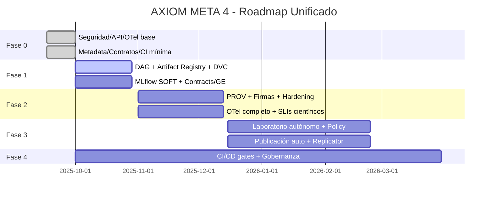

Estoy integrando ambos análisis y elaborando un roadmap unificado, concreto y accionable.

### Roadmap Unificado AXIOM META 4 (fusión de análisis previos + analisisgpt5normal.md)

> Progreso Agente MID (hoy)
> - API v1 (en curso):
>   - Añadido VersionPrefixMiddleware para aceptar /api/v1/* y reescribir internamente a /api/*, manteniendo compatibilidad y anunciando deprecación de /api mediante headers (Deprecation/Sunset). Archivos: <mcfile name="middleware.py" path="./app/middleware.py"></mcfile> y <mcfile name="main.py" path="./main.py"></mcfile>
> - Seguridad (parcial):
>   - Endurecidas cabeceras de seguridad: HSTS 2 años + preload, COOP/CORP, Referrer-Policy, Permissions-Policy y CSP estricta con excepción report-only en /docs|/redoc. Archivo: <mcfile name="middleware.py" path="./app/middleware.py"></mcfile>
> - Observabilidad base (planificada):
>   - Mantener Prometheus /metrics. Próximo paso: instrumentación ligera OpenTelemetry opcional (sin romper dependencias) y propagación de trace_id en logs de clientes httpx.
> - Pendiente (siguientes horas): CI mínima, modelos Pydantic v2 de artefactos, esquema Artifact Manifest y calibración de ensemble.

#### Contexto y objetivos
- Consolidar AXIOM META 4 como laboratorio autónomo multidominio con rigor científico, reproducibilidad verificable y operación de clase producción.
- Unificar orquestación de investigación (hipótesis → evidencia → ejecución segura → análisis → publicación) con linaje integral, control de riesgo/ética y gobernanza de artefactos.

> **Progreso Agente LOW (17 Sep 2025)**
> - Reproducibilidad básica (completado):
>   - CI/CD multi-job: build-test, manifest-validation, signature-verification (bloqueante), data-validation, api-contract-fuzz
>   - Schema JSON manifests + validador strict (`scripts/validate_manifests.py`)
>   - Firmas Ed25519 + timestamps (`scripts/sign_manifest.py`, `scripts/verify_manifest_signatures.py`)
>   - CronJob Kubernetes validación datos nocturna con hardening (`kubernetes/cronjob-data-validation.yaml`)
> - Integridad avanzada (completado):
>   - Scripts Merkle tree: `scripts/compute_merkle_root.py` y `scripts/verify_merkle_root.py`
>   - Job CI merkle-verification + scientific-gates + sandbox-check placeholders
>   - Reproducible bundle: `scripts/build_repro_bundle.py` y `scripts/verify_repro_bundle.py`
> - Documentación ampliada: `docs/REPRODUCIBILITY_INTEGRITY.md` con secciones CronJob, Merkle (amenazas/verificación), sandbox y scientific gates
> - Pendiente (en progreso): Job CI bundle, plantilla LaTeX + script inyección metadata, docs sección bundle/publicación

### Principios rectores
- Rigor y reproducibilidad por defecto: contratos de datos, linaje PROV, firmas y verificación en runtime.
- Seguridad y ética embebidas: threat model, RBAC/ABAC, sandbox endurecido, policy-aware scheduling.
- Observabilidad integral: métricas, trazas y logs correlacionados end-to-end.
- Automación continua: CI/CD con gates (calidad, seguridad, ciencia).
- Costo/rendimiento conscientes: GPU/resource-aware con SLOs y límites.

### KPIs y SLOs (objetivos de salida)
- Seguridad: 100% endpoints con auth; 0 findings críticos en bandit/pip-audit; sandbox sin escapes conocidos (fuzz básico).
- Reproducibilidad: ≥90% de experimentos con artifact bundle completo y hash verificado; ≥95% hash-match en re-ejecuciones.
- Observabilidad: 100% requests con trace_id; dashboards por dominio; MTTR < 30 min.
- Ciencia: ≥3 workflows multidominio/mes con publicación reproducible (manifiesto + linaje + firma).
- Rendimiento: p99 < 500 ms para endpoints core; ratio de aciertos de caché > 80% en cálculos repetibles.

### Ejes temáticos (convergentes)
- Seguridad/Integridad: OAuth2/JWT + RBAC/ABAC, CSP estricto, sandbox con gVisor/Firecracker, firmas Ed25519 + Merkle, HMAC en runtime.
- Orquestación reproducible: Scheduler→DAG con dependencias, reintentos/backoff, checkpointing, artifact registry interno, DVC enforcement.
- Contratos y datos: Modelos Pydantic por artefacto, validaciones (Great Expectations), JSONSchema en APIs, contract tests.
- Observabilidad: OpenTelemetry (traces-metrics-logs), Prometheus/Grafana, métricas científicas (calibración, drift).
- MLOps: MLflow como fuente de verdad, promoción automática, CI/CD con gates científicos y de seguridad.
- Laboratorio autónomo: Multi‑Agente + Orchestrator + Knowledge Graph, policy-aware scheduling (plausibilidad/ética/costo/impacto), publicación automática (LaTeX/DOI interno).

### Roadmap por fases (entregables, criterios de aceptación y dependencias)

#### Fase 0 — Quick Wins (1–2 semanas)
- Seguridad básica y API
  - Implementar OAuth2/JWT con scopes; RBAC por router/tag.
  - Activar CSP estricta y endurecer SecurityHeaders.
  - Versionar API `/api/v1` y unificar prefijos/tags.
  - Criterio: 100% endpoints críticos protegidos; OpenAPI v1 estable; smoke tests de auth.
- Observabilidad mínima viable
  - Integrar OpenTelemetry (trazas) con export Prometheus; wirear `trace_id` en logs.
  - Dashboard base: latencia p50/p95/p99, tasa error, hit/miss caché.
  - Criterio: 100% requests con `trace_id`; dashboard accesible; alertas básicas.
- Pipeline metadata y contratos mínimos
  - Ampliar `pipeline_metadata_v4.py` con Brier, ECE, PR/ROC, hyperparams, seeds; firmar JSON (HMAC).
  - Definir Pydantic para artefactos clave (WeakLabelRecord, EnsembleRecord) y validar en lectura/escritura.
  - Criterio: JSON enriquecido en `models/` con firma; parquet de weak labels validado.
- Ensemble y calibración
  - Calibración isotónica/Platt; grid simple de pesos; registro de resultados en MLflow y `models/`.
  - Criterio: mejora en ECE y Brier vs baseline reportada y versionada.
- CI mínima
  - Jobs: lint, unit + integración, bandit/pip-audit, build; smoke pipeline con sample data.
  - Criterio: pipeline verde; artefactos de ejemplo publicados en `reports/`.

Dependencias: ninguna (arranque).

#### Fase 1 — Orquestación reproducible (3–4 semanas)
- Scheduler→DAG declarativo
  - Extender `Experiment Scheduler` para ejecutar DAGs con dependencias, retries/backoff y checkpoint por step (estado persistido).
  - Criterio: reanudación idempotente tras fallo intermedio; métricas de paso.
- Artifact Registry interno
  - “artifact_map” unificado: path, schema, hash, productor, parámetros, commit git; validación antes de uso.
  - Criterio: mapa generado por pipeline; validación previa a cada step registrada en logs/metrics.
- DVC enforcement + Snapshots
  - DVC obligatorio en datasets/embeddings/índices; snapshots por step con hash + commit + parámetros.
  - Criterio: `dvc.lock` actualizado; verificación reproducible local (target sample).
- MLflow “source of truth”
  - Registro automático (params, métricas CV/test, artefactos, firma); stage transitions por política.
  - Criterio: `/api/mlflow-registry` refleja último modelo con stage y artefactos/links a runs.
- Validación de datos y contratos
  - Great Expectations (o validaciones propias) en puntos críticos; abortar con `.fail.json` detallado.
  - Contract tests para JSONSchema de endpoints v1.
  - Criterio: fallos explicables antes de entrenamiento; tests de contrato pasando.

Dependencias: Fase 0 (observabilidad/auth/contratos mínimos).

#### Fase 2 — Linaje, seguridad y datos (4–6 semanas)
- Grafo de proveniencia (W3C PROV-like)
  - Servicio interno y API: `GET /api/provenance/graph`, `GET /api/provenance/lineage/{artifact}`; visualización (vis/pyvis).
  - Endpoint de sistema: `/api/system/lineage` agregado a `main.py`.
  - Criterio: linaje completo navegable desde ingesta→publicación; pruebas en `tests/` de subgrafos.
- Firma e integridad avanzadas
  - Merkle trees por paquete; firma Ed25519; anclaje opcional (OpenTimestamps). Verificación en runtime.
  - Criterio: verificación de integridad antes de inferencia/uso; error explícito y métrica.
- Threat model y hardening
  - Documento de amenazas (routers/sandbox/ingestión); fuzz en endpoints de código/expresiones.
  - Sandbox con gVisor/Firecracker, seccomp, fs RO, cgroups; límites estrictos por job.
  - Criterio: fuzz suite estable; medidas de aislamiento verificadas (pruebas de fuga negativas).
- Observabilidad avanzada
  - OTel completo (traces/metrics/logs) con Loki/Tempo o equivalente; correlación desde API→Scheduler→Sandbox→DB.
  - Métricas científicas en `/metrics`: calibración, drift, coverage validaciones.
  - Criterio: paneles por dominio; alertas con SLIs científicos.

Dependencias: Fases 0–1.

#### Fase 3 — Laboratorio autónomo multidominio (6–10 semanas)
- Integración Multi‑Agente + Orchestrator + KGraph
  - Cerrar el loop: hipótesis→evaluación de plausibilidad→diseño experimental→ejecución segura→análisis→publicación.
  - `policy-aware scheduling`: función de costo multiobjetivo (plausibilidad, ética/riesgo, costo GPU, impacto).
  - Criterio: ≥1 workflow semanal end‑to‑end que produzca “Research Package” reproducible.
- Publicación automática y rigor
  - Plantillas LaTeX; preregistro (hipótesis, criterios de éxito, plan de análisis) antes de ejecutar; anexos con datos/código/hashes; DOI interno opcional.
  - “Replicability Checker”: re-ejecuta en entorno limpio y compara hashes/métricas.
  - Criterio: paquete con manifiesto, linaje, firma y verificación replicable.
- Gestión de recursos y coste
  - GPU cost-aware: perfiles por job (vRAM/tiempo), cuotas por tenant, spot/preemptibles, escalado.
  - Criterio: reducción de costo por job (>20%) sin degradar SLO científicos.
- SLOs y monitoreo activo
  - `/api/system/slo` agregada; alertas por degradación (drift, calibración, colas, p99).
  - Criterio: SLO tracking continuo y alertas operativas.

Dependencias: Fases 0–2.

#### Fase 4 — Excelencia operativa (continuo)
- CI/CD con gates
  - Bandit/pip‑audit/trivy, tests (unit/integration/e2e), migraciones dry‑run, validación `/metrics`.
  - Canary + Blue/Green en routers críticos; smoke post‑despliegue.
- Gobernanza y documentación
  - Completar `docs/EXECUTIVE_SUMMARY_LICENSE_STRATEGY.md`, `docs/OPEN_SOURCE_GOVERNANCE_STRATEGY.md`.
  - `docs/INDEX.md` con estado (stable/experimental/deprecated) y TOC; README como portal.
- Data Quality continua
  - Reglas y monitores automatizados; tickets automáticos con causa‑raíz y artefactos `.fail.json`.
- DX/Plantillas
  - Playbooks/Notebooks reproducibles y Typer CLI para flujos canónicos; feature flags por entorno.

Criterios: releases regulares con changelog, métricas de calidad y seguridad públicas; onboarding ágil.

### Entregables clave por fase
- F0: OpenAPI v1 + auth/RBAC, OTel base, dashboards básicos, metadata enriquecida firmada, Pydantic artefactos, CI mínima.
- F1: DAG con checkpointing, artifact map + DVC enforced, MLflow integrado con promociones, validación de datos y contract tests, cronjobs.
- F2: PROV graph + API/visualización, firmas Ed25519+Merkle, sandbox endurecido, fuzzing, OTel completo con SLIs científicos.
- F3: Pipeline autónomo multidominio, policy-aware scheduling, bundles de publicación LaTeX + preregistro + replicador, GPU cost-aware.
- F4: CI/CD con gates y despliegues progressivos, gobernanza/licencias, data quality continua, DX superior.

### Dependencias y riesgos
- Dependencias técnicas: DVC/MLflow/OTel/Firecracker/gVisor; Redis/DB estables; permisos de kernel para aislamiento.
- Riesgos: aumento de complejidad operativa; falsos positivos en validaciones; coste GPU; drift de datos.
- Mitigación: feature flags, despliegues progresivos, “shadow runs”, conjuntos de validación fijos, límites de recursos, budget por tenant.

### Estructuras estandarizadas (recomendadas)
- Manifiesto de artefactos (YAML/JSON) por modelo/índice/publicación:
  - Campos: id, tipo, productor (step), parámetros, semillas, versiones, hash/merkle_root, firma, dataset snapshot (DVC), métricas (PR/ROC, Brier, ECE), validaciones de datos, fecha/commit.
- Contratos Pydantic por artefacto: `EnrichedRow`, `EmbeddingRecord`, `ClusterRecord`, `WeakLabelRecord`, `EnsembleRecord`, `TrainingMetadata`.
- Endpoints de sistema: `/api/system/lineage`, `/api/system/slo`, `/api/provenance/*`.

### Plan de adopción y cambios
- Probar F0 en rama `feature/v1-api-security-otel`; canary interno.
- Migración progresiva a v1 con compatibilidad temporal (deprecation headers) y contract tests.
- “Brownout” de endpoints legacy tras 2 releases con guía de migración.

### Gantt de alto nivel (orientativo)

### Backlog dirigido (selección)
- API v1: normalizar prefijos y tags; JSONSchema autogenerado a `docs/API_REFERENCE.md`.
- Contract tests backward-compat.
- `Feature flags` por entorno para routers experimentales.
- `/api/tools/*` con límites de payload estrictos y validación de schemas.
- Canary para `plausibility`, `scheduler`, `sandbox`, `mlflow-registry`.
- Notebooks de “Research Bundle” y “Reproducibility Checklist”.

Con este roadmap unificado, AXIOM META 4 pasa de una base industrial sólida a un laboratorio autónomo multidominio con garantías de seguridad, reproducibilidad y excelencia científica, concretando los quick wins de analisisgpt5normal.md y extendiéndolos con autenticación, observabilidad distribuida, linaje provable, automatización CI/CD y una orquestación inteligente orientada a generar ciencia nueva, rigurosa y verificable.