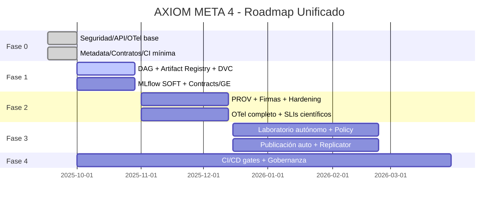

> English translation and privacy-reviewed derivative of an archived manual. Historical technical claims have not been revalidated for this release. Public maintainer: **Ganador1**.

I am integrating both analyses and preparing a unified, concrete, and actionable roadmap.

### Unified Roadmap AXIOM META 4 (fusion of previous analyses + analisisgpt5normal.md)

> MID Agent progress (today)
> - API v1 (in progress):
>   - Added VersionPrefixMiddleware to accept /api/v1/* and internally rewrite to /api/*, maintaining compatibility and announcing deprecation of /api via headers (Deprecation/Sunset). Files: <mcfile name="middleware.py" path="./app/middleware.py"></mcfile> and <mcfile name="main.py" path="./main.py"></mcfile>
> - Security (partial):
>   - Hardened security headers: HSTS 2 years + preload, COOP/CORP, Referrer-Policy, Permissions-Policy, and strict CSP with report-only exception on /docs|/redoc. File: <mcfile name="middleware.py" path="./app/middleware.py"></mcfile>
> - Base observability (planned):
>   - Keep Prometheus /metrics. Next step: optional lightweight OpenTelemetry instrumentation (without breaking dependencies) and propagation of trace_id in httpx client logs.
> - Pending (next hours): minimal CI, Pydantic v2 artifact models, Artifact Manifest schema, and ensemble calibration.

#### Context and objectives
- Consolidate AXIOM META 4 as an autonomous multi-domain laboratory with scientific rigor, verifiable reproducibility, and production-grade operation.
- Unify research orchestration (hypothesis → evidence → safe execution → analysis → publication) with end-to-end lineage, risk/ethics control, and artifact governance.

> **LOW Agent progress (17 Sep 2025)**
> - Basic reproducibility (completed):
>   - Multi-job CI/CD: build-test, manifest-validation, signature-verification (blocking), data-validation, api-contract-fuzz
>   - JSON schema manifests + strict validator (`scripts/validate_manifests.py`)
>   - Ed25519 signatures + timestamps (`scripts/sign_manifest.py`, `scripts/verify_manifest_signatures.py`)
>   - Kubernetes CronJob nightly data validation with hardening (`kubernetes/cronjob-data-validation.yaml`)
> - Advanced integrity (completed):
>   - Merkle tree scripts: `scripts/compute_merkle_root.py` and `scripts/verify_merkle_root.py`
>   - CI job merkle-verification + scientific-gates + sandbox-check placeholders
>   - Reproducible bundle: `scripts/build_repro_bundle.py` and `scripts/verify_repro_bundle.py`
> - Expanded documentation: `docs/REPRODUCIBILITY_INTEGRITY.md` with CronJob, Merkle (threats/verification), sandbox, and scientific gates sections
> - Pending (in progress): CI bundle job, LaTeX template + metadata injection script, docs bundle/publication section

### Guiding principles
- Rigor and reproducibility by default: data contracts, PROV lineage, signatures, and runtime verification.
- Embedded security and ethics: threat model, RBAC/ABAC, hardened sandbox, policy-aware scheduling.
- End-to-end observability: metrics, traces, and logs correlated end-to-end.
- Continuous automation: CI/CD with gates (quality, security, science).
- Cost/performance aware: GPU/resource-aware with SLOs and limits.

### KPIs and SLOs (output objectives)
- Security: 100% endpoints with auth; 0 critical findings in bandit/pip-audit; sandbox with no known escapes (basic fuzz).
- Reproducibility: ≥90% of experiments with a complete artifact bundle and verified hash; ≥95% hash-match on re-runs.
- Observability: 100% requests with trace_id; dashboards by domain; MTTR < 30 min.
- Science: ≥3 multi-domain workflows/month with reproducible publication (manifest + lineage + signature).
- Performance: p99 < 500 ms for core endpoints; cache hit ratio > 80% on repeatable computations.

### Thematic axes (convergent)
- Security/Integrity: OAuth2/JWT + RBAC/ABAC, strict CSP, sandbox with gVisor/Firecracker, Ed25519 + Merkle signatures, runtime HMAC.
- Reproducible orchestration: Scheduler→DAG with dependencies, retries/backoff, checkpointing, internal artifact registry, DVC enforcement.
- Contracts and data: Pydantic models per artifact, validations (Great Expectations), JSONSchema in APIs, contract tests.
- Observability: OpenTelemetry (traces-metrics-logs), Prometheus/Grafana, scientific metrics (calibration, drift).
- MLOps: MLflow as source of truth, automatic promotion, CI/CD with scientific and security gates.
- Autonomous laboratory: Multi-Agent + Orchestrator + Knowledge Graph, policy-aware scheduling (plausibility/ethics/cost/impact), automatic publication (LaTeX/internal DOI).

### Roadmap by phases (deliverables, acceptance criteria, and dependencies)

#### Phase 0 — Quick Wins (1–2 weeks)
- Basic security and API
  - Implement OAuth2/JWT with scopes; RBAC by router/tag.
  - Enable strict CSP and harden SecurityHeaders.
  - Version API `/api/v1` and unify prefixes/tags.
  - Criterion: 100% critical endpoints protected; stable OpenAPI v1; auth smoke tests.
- Minimum viable observability
  - Integrate OpenTelemetry (traces) with Prometheus export; wire `trace_id` in logs.
  - Base dashboard: p50/p95/p99 latency, error rate, cache hit/miss.
  - Criterion: 100% requests with `trace_id`; accessible dashboard; basic alerts.
- Metadata pipeline and minimum contracts
  - Extend `pipeline_metadata_v4.py` with Brier, ECE, PR/ROC, hyperparams, seeds; sign JSON (HMAC).
  - Define Pydantic for key artifacts (WeakLabelRecord, EnsembleRecord) and validate on read/write.
  - Criterion: enriched JSON in `models/` with signature; validated weak labels parquet.
- Ensemble and calibration
  - Isotonic/Platt calibration; simple weight grid; record results in MLflow and `models/`.
  - Criterion: improvement in ECE and Brier vs baseline reported and versioned.
- Minimal CI
  - Jobs: lint, unit + integration, bandit/pip-audit, build; smoke pipeline with sample data.
  - Criterion: green pipeline; example artifacts published in `reports/`.

Dependencies: none (startup).

#### Phase 1 — Reproducible orchestration (3–4 weeks)
- Declarative Scheduler→DAG
  - Extend `Experiment Scheduler` to execute DAGs with dependencies, retries/backoff, and per-step checkpoint (persisted state).
  - Criterion: idempotent resumption after intermediate failure; step metrics.
- Internal Artifact Registry
  - Unified “artifact_map”: path, schema, hash, producer, parameters, git commit; validation before use.
  - Criterion: map generated by pipeline; validation before each step recorded in logs/metrics.
- DVC enforcement + Snapshots
  - Mandatory DVC on datasets/embeddings/indexes; per-step snapshots with hash + commit + parameters.
  - Criterion: `dvc.lock` updated; reproducible local verification (target sample).
- MLflow “source of truth”
  - Automatic logging (params, CV/test metrics, artifacts, signature); stage transitions by policy.
  - Criterion: `/api/mlflow-registry` reflects latest model with stage and artifacts/links to runs.
- Data and contract validation
  - Great Expectations (or custom validations) at critical points; abort with detailed `.fail.json`.
  - Contract tests for JSONSchema of v1 endpoints.
  - Criterion: explainable failures before training; contract tests passing.

Dependencies: Phase 0 (observability/auth/minimum contracts).

#### Phase 2 — Lineage, security, and data (4–6 weeks)
- Provenance graph (W3C PROV-like)
  - Internal service and API: `GET /api/provenance/graph`, `GET /api/provenance/lineage/{artifact}`; visualization (vis/pyvis).
  - System endpoint: `/api/system/lineage` added to `main.py`.
  - Criterion: complete lineage navigable from ingestion→publication; tests in `tests/` of subgraphs.
- Advanced signing and integrity
  - Merkle trees per package; Ed25519 signature; optional anchoring (OpenTimestamps). Runtime verification.
  - Criterion: integrity verification before inference/use; explicit error and metric.
- Threat model and hardening
  - Threat document (routers/sandbox/ingestion); fuzz on code/expression endpoints.
  - Sandbox with gVisor/Firecracker, seccomp, RO fs, cgroups; strict per-job limits.
  - Criterion: stable fuzz suite; verified isolation measures (negative leak tests).
- Advanced observability
  - Full OTel (traces/metrics/logs) with Loki/Tempo or equivalent; correlation from API→Scheduler→Sandbox→DB.
  - Scientific metrics in `/metrics`: calibration, drift, validation coverage.
  - Criterion: panels by domain; alerts with scientific SLIs.

Dependencies: Phases 0–1.

#### Phase 3 — Autonomous multi-domain laboratory (6–10 weeks)
- Multi-Agent + Orchestrator + KGraph integration
  - Close the loop: hypothesis→plausibility evaluation→experimental design→safe execution→analysis→publication.
  - `policy-aware scheduling`: multi-objective cost function (plausibility, ethics/risk, GPU cost, impact).
  - Criterion: ≥1 weekly end-to-end workflow that produces a reproducible “Research Package”.
- Automatic publication and rigor
  - LaTeX templates; preregistration (hypothesis, success criteria, analysis plan) before execution; appendices with data/code/hashes; optional internal DOI.
  - “Replicability Checker”: re-runs in a clean environment and compares hashes/metrics.
  - Criterion: package with manifest, lineage, signature, and replicable verification.
- Resource and cost management
  - GPU cost-aware: per-job profiles (vRAM/time), per-tenant quotas, spot/preemptible, scaling.
  - Criterion: cost reduction per job (>20%) without degrading scientific SLOs.
- SLOs and active monitoring
  - `/api/system/slo` added; degradation alerts (drift, calibration, queues, p99).
  - Criterion: continuous SLO tracking and operational alerts.

Dependencies: Phases 0–2.

#### Phase 4 — Operational excellence (continuous)
- CI/CD with gates
- Bandit/pip-audit/trivy, tests (unit/integration/e2e), dry-run migrations, validation `/metrics`.
  - Canary + Blue/Green on critical routers; post-deployment smoke.
- Governance and documentation
  - Complete `docs/EXECUTIVE_SUMMARY_LICENSE_STRATEGY.md`, `docs/OPEN_SOURCE_GOVERNANCE_STRATEGY.md`.
  - `docs/INDEX.md` with status (stable/experimental/deprecated) and TOC; README as portal.
- Continuous Data Quality
  - Automated rules and monitors; automatic tickets with root cause and artifacts `.fail.json`.
- DX/Templates
  - Reproducible playbooks/notebooks and Typer CLI for canonical flows; feature flags per environment.

Criteria: regular releases with changelog, public quality and security metrics; agile onboarding.

### Key deliverables by phase
- F0: OpenAPI v1 + auth/RBAC, base OTel, basic dashboards, signed enriched metadata, Pydantic artifacts, minimal CI.
- F1: DAG with checkpointing, artifact map + DVC enforced, MLflow integrated with promotions, data validation and contract tests, cronjobs.
- F2: PROV graph + API/visualization, Ed25519+Merkle signatures, hardened sandbox, fuzzing, full OTel with scientific SLIs.
- F3: Autonomous multi-domain pipeline, policy-aware scheduling, LaTeX publication bundles + preregistration + replicator, GPU cost-aware.
- F4: CI/CD with gates and progressive deployments, governance/licenses, continuous data quality, superior DX.

### Dependencies and risks
- Technical dependencies: DVC/MLflow/OTel/Firecracker/gVisor; stable Redis/DB; kernel permissions for isolation.
- Risks: increased operational complexity; false positives in validations; GPU cost; data drift.
- Mitigation: feature flags, progressive deployments, "shadow runs", fixed validation sets, resource limits, per-tenant budget.

### Standardized structures (recommended)
- Artifact manifest (YAML/JSON) per model/index/publication:
  - Fields: id, type, producer (step), parameters, seeds, versions, hash/merkle_root, signature, dataset snapshot (DVC), metrics (PR/ROC, Brier, ECE), data validations, date/commit.
- Pydantic contracts per artifact: `EnrichedRow`, `EmbeddingRecord`, `ClusterRecord`, `WeakLabelRecord`, `EnsembleRecord`, `TrainingMetadata`.
- System endpoints: `/api/system/lineage`, `/api/system/slo`, `/api/provenance/*`.

### Adoption and change plan
- Test F0 on branch `feature/v1-api-security-otel`; internal canary.
- Progressive migration to v1 with temporary compatibility (deprecation headers) and contract tests.
- "Brownout" of legacy endpoints after 2 releases with migration guide.

### High-level Gantt (indicative)

### Targeted backlog (selection)
- API v1: normalize prefixes and tags; JSONSchema autogenerated to `docs/API_REFERENCE.md`.
- Backward-compat contract tests.
- `Feature flags` per environment for experimental routers.
- `/api/tools/*` with strict payload limits and schema validation.
- Canary for `plausibility`, `scheduler`, `sandbox`, `mlflow-registry`.
- "Research Bundle" and "Reproducibility Checklist" notebooks.

With this unified roadmap, AXIOM META 4 moves from a solid industrial base to an autonomous multi-domain laboratory with guarantees of security, reproducibility, and scientific excellence, concretizing the quick wins of analisisgpt5normal.md and extending them with authentication, distributed observability, provable lineage, CI/CD automation, and intelligent orchestration aimed at generating new, rigorous, and verifiable science.
